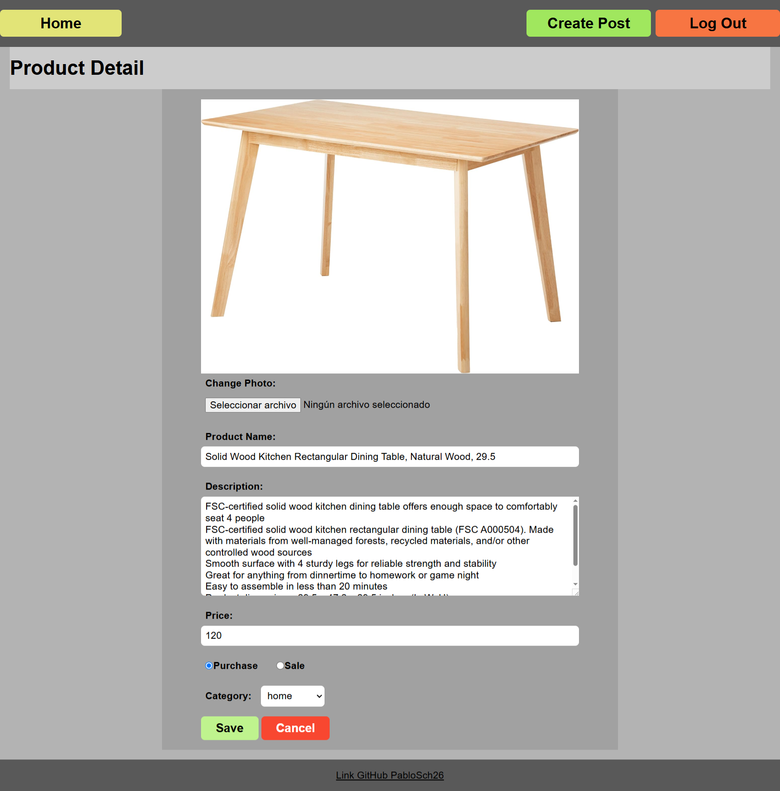

# Entrega del Proyecto de Desarrollo Frontend con JavaScript

## Selecciona tu idioma

- 🇺🇸 [Inglés](README.md)
- 🇩🇪 [Alemán](README.de.md)

## Conocimientos trabajados

- Funcionamiento básico de un navegador.
- Browser Object Model (BOM):
  - Navigation
  - Location
  - Window
- Document Object Model (DOM), sus nodos y elementos.
- Selección de nodos.
- Creación y eliminación de elementos del DOM.
- Manipulación de atributos del DOM, así como de sus estilos y clases CSS.
- Manejo de eventos del DOM.
- Comportamientos por defecto en los componentes HTML.
- *Event Bubbling* y *Capturing*.
- Promesas y sus estados: *pending*, *fulfilled* y *rejected*.
- Peticiones HTTP con `fetch`.
- `localStorage` y `sessionStorage`.
- Almacenamiento local de datos en HTML5: cookies, storage e IndexedDB.

## Descripción del proyecto

Con el fin de ejercitar y demostrar los conocimientos adquiridos en clases virtuales, este proyecto consiste en desarrollar una aplicación web similar a Wallapop. No se permite utilizar librerías o *frameworks* de JavaScript, aunque sí se pueden usar utilidades de CSS externas.  
Además, se debe proporcionar un archivo `db.json` para el backend con los datos de ejemplo necesarios para la corrección de la práctica.

### 1. Listado de posts

- Cada post debe mostrar su imagen (si tiene), nombre, descripción, precio y si es de compra o venta.  
- Los posts deben obtenerse a través de un *endpoint*.  
- La pantalla de listado debe gestionar todos los estados de la interfaz:

  - **Vacío** (no hay posts).
  - **Error** (al cargar los posts).
  - **Carga** (mientras se cargan los posts).
  - **Éxito** (cuando los posts se han recuperado correctamente).

- Al pulsar sobre un post, se debe acceder a su pantalla de detalle.  
- Si el usuario ha iniciado sesión, debe mostrarse un botón para acceder a la pantalla de creación de posts.

### 2. Detalle de post

- Debe mostrar imagen (si tiene), nombre, descripción, precio y si es de compra o venta.  
- Debe gestionar todos los estados de la interfaz:

  - **Vacío** (no existe el post).
  - **Error** (al cargar la información del post).
  - **Carga** (mientras se carga la información).
  - **Éxito** (cuando se ha recuperado la información correctamente).

- Si el usuario está autenticado y el post le pertenece, debe mostrarse un botón para eliminarlo (previa confirmación).

### 3. Creación de un post

- Debe incluir un formulario con los siguientes campos:
  - **Foto** (opcional).
  - **Nombre** (obligatorio).
  - **Descripción** (obligatoria).
  - **Precio** (obligatorio).
  - **Compra/Venta** (obligatorio).

- Al enviar el formulario, se debe hacer una petición al backend para guardar el post.  
- Se deben gestionar los estados de la interfaz:

  - **Error** (al guardar el post).
  - **Carga** (durante el guardado).
  - **Éxito** (cuando se guarda correctamente).

- Solo se puede acceder a esta pantalla si el usuario está logueado. En caso contrario, se redirige al listado e informa del motivo.

### 4. Login

- Debe mostrar un formulario con nombre de usuario y contraseña.  
- Al enviar el formulario, se debe autenticar al usuario contra el backend y obtener un token JWT.  
- Se deben gestionar los estados: carga, error y éxito.

### 5. Registro

- Similar a la pantalla de login.  
- Debe registrar al usuario en el backend.  
- Se deben gestionar los estados: carga, error y éxito.

## Opcional

- Paginación de posts en el listado (la API devuelve solo 10 por defecto).
- Buscador de posts.
- Edición de posts (solo si el usuario es propietario).
- Filtrado por etiquetas (*tags*) estáticas.
- Hacer que los *tags* sean dinámicos.

## API REST de apoyo para la práctica

Para emular una base de datos se utilizará **sparrest.js**, una API REST creada por el docente Alberto Casero (KeepCoding), basada en `json-server`.

### Clonación del repositorio

```bash
git clone https://github.com/kasappeal/sparrest.js.git
```

Esto levantará el servidor y pondrá en funcionamiento la API REST para que puedas interactuar con la base de datos simulada.

## Tecnologías utilizadas

- **HTML**: Para la estructuración del contenido y la creación de la estructura de la página web.
- **CSS**: Para el diseño y estilo visual de la página, asegurando una experiencia de usuario atractiva y coherente.

## Instrucciones de instalación y uso

### Requisitos de software

- **Visual Studio Code** (testeado en la versión 1.99.0)
- **Live Server** (addon de Visual Studio Code, opcional)

### Descripción de los programas

- **Visual Studio Code**: Entorno de desarrollo integrado (IDE) necesario para ejecutar el proyecto. Asegúrate de utilizar la versión 1.99.0 para evitar problemas de compatibilidad.
- **Live Server**: Extensión de Visual Studio Code que permite visualizar los archivos HTML de manera local en un navegador, mostrando los cambios en tiempo real.

### Pasos para utilizar este proyecto

1. Descargue el archivo comprimido del proyecto desde GitHub a su ordenador o clónelo mediante SourceTree.

2. Una vez descargado o clonado el proyecto, agréguele a su espacio de trabajo en Visual Studio Code.

3. Una vez descargado Sparrest, actualice sus dependencias. Luego, para incorporar la base de datos probada en este proyecto, copie el archivo `db.json` del proyecto y reemplácelo por el que se genera en Sparrest una vez inicializado.

Para iniciar la base de datos, simplemente ejecute el siguiente comando dentro del directorio de Sparrest:

```bash
npm start
```

### Notas

- El archivo `db.json` contiene tres cuentas y 14 publicaciones. Estas son las credenciales de cada cuenta para iniciar sesión en el proyecto y editar las publicaciones ya creadas:

- [pablsch.it@gmail.com](mailto:pablsch.it@gmail.com) / pwd: 123456  
- [Pedro.it@gmail.com](mailto:Pedro.it@gmail.com) / pwd: 123456  
- [jose.JJ@gmail.com](mailto:jose.JJ@gmail.com) / pwd: 123456

## Sin contribuciones ni licencias

Este proyecto no cuenta con contribuciones externas ni licencia en este momento.

## Vista previa del proyecto

### Home


### Home Mobile


### Create Post


### Post Detail


### Edit Post


