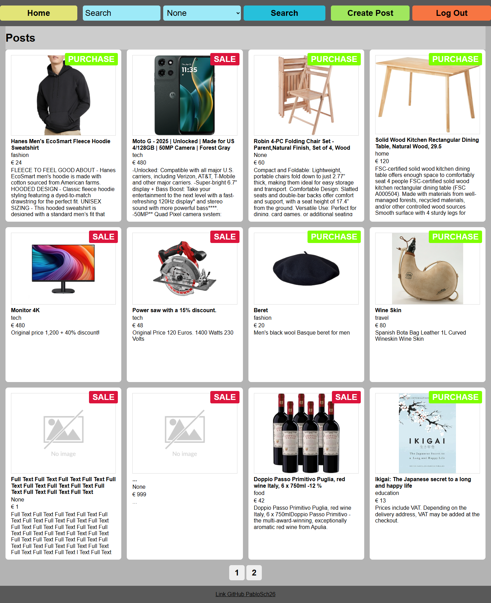
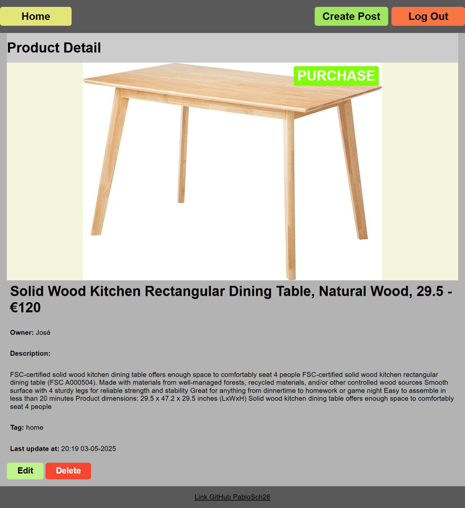

# Frontend Development Project Delivery with JavaScript

## Select your language

- 🇪🇸 [Spanish](README.es.md)
- 🇩🇪 [German](README.de.md)

## Topics Covered

- Basic browser functionality.
- Browser Object Model (BOM):
  - Navigation
  - Location
  - Window
- Document Object Model (DOM), its nodes and elements.
- Node selection.
- DOM element creation and deletion.
- Manipulating DOM attributes, styles, and CSS classes.
- Handling DOM events.
- Default behaviors in HTML components.
- Event Bubbling & Capturing.
- Promises and their states: *pending*, *fulfilled*, and *rejected*.
- HTTP requests with `fetch`.
- `localStorage` and `sessionStorage`.
- Local data storage in HTML5: cookies, storage, and IndexedDB.

## Project Description

To practice and demonstrate the knowledge acquired in virtual classes, this project consists of developing a web application similar to Wallapop. JavaScript libraries or frameworks are not allowed, although external CSS utilities may be used.  
Additionally, a `db.json` file must be provided for the backend, containing sample data required for grading the assignment.

### 1. Post Listing

- Each post must display its image (if available), name, description, price, and whether it’s for sale or purchase.  
- Posts must be retrieved from an endpoint.  
- The listing screen must manage all UI states:

  - **Empty** (no posts available).
  - **Error** (while loading posts).
  - **Loading** (while posts are being loaded).
  - **Success** (when posts have been successfully retrieved).

- Clicking on a post should open its detail screen.  
- If the user is logged in, a button should appear to access the post creation screen.

### 2. Post Detail

- Must display the image (if available), name, description, price, and whether it’s for sale or purchase.  
- Must manage all UI states:

  - **Empty** (post does not exist).
  - **Error** (while loading post information).
  - **Loading** (while information is being loaded).
  - **Success** (when the information is successfully retrieved).

- If the user is authenticated and owns the post, a button to delete it must be shown (with confirmation).

### 3. Post Creation

- Must include a form with the following fields:
  - **Photo** (optional).
  - **Name** (required).
  - **Description** (required).
  - **Price** (required).
  - **Buy/Sell** (required).

- On form submission, a request must be sent to the backend to save the post.  
- The UI must handle the following states:

  - **Error** (while saving the post).
  - **Loading** (during the saving process).
  - **Success** (when the post is saved successfully).

- This screen is accessible only to logged-in users. Otherwise, redirect to the listing page and inform the user of the reason.

### 4. Login

- Must display a form with username and password fields.  
- On submission, the user should be authenticated via the backend and receive a JWT token.  
- The following states must be handled: loading, error, and success.

### 5. Registration

- Similar to the login screen.  
- Must register the user via the backend.  
- The following states must be handled: loading, error, and success.

## Optional Features

- Post pagination in the listing (the API returns only 10 by default).
- Post search functionality.
- Post editing (only if the user is the owner).
- Filtering by static tags.
- Making tags dynamic.

## REST API for Practice Support

To emulate a database, **sparrest.js** will be used — a REST API created by instructor Alberto Casero (KeepCoding), based on `json-server`.

### Cloning the Repository

```bash
git clone https://github.com/kasappeal/sparrest.js.git
```

This will start the server and run the REST API, allowing interaction with the simulated database.

## Technologies Used

- **HTML**: For structuring the content and building the layout of the web page.
- **CSS**: For visual design and styling, ensuring an attractive and consistent user experience.

## Installation and Usage Instructions

### Software Requirements

- **Visual Studio Code** (tested on version 1.99.0)
- **Live Server** (Visual Studio Code extension, optional)

### Program Descriptions

- **Visual Studio Code**: Integrated Development Environment (IDE) required to run the project. Make sure to use version 1.99.0 to avoid compatibility issues.
- **Live Server**: A Visual Studio Code extension that allows you to preview HTML files locally in a browser, showing real-time changes.

### Steps to Use This Project

1. Download the compressed project file from GitHub to your computer or clone it using SourceTree.

2. Once downloaded or cloned, add it to your workspace in Visual Studio Code.

3. After downloading Sparrest, update its dependencies. Then, to incorporate the sample database used in this project, copy the project's `db.json` file and replace the one generated by Sparrest when initialized.

To start the database, simply run the following command inside the Sparrest directory:

```bash
npm start
```

### Notes

- The `db.json` file contains three accounts and 14 posts. These are the credentials for logging in and editing the existing posts:

- [pablsch.it@gmail.com](mailto:pablsch.it@gmail.com) / pwd: 123456  
- [Pedro.it@gmail.com](mailto:Pedro.it@gmail.com) / pwd: 123456  
- [jose.JJ@gmail.com](mailto:jose.JJ@gmail.com) / pwd: 123456

## No Contributions or License

This project currently does not include external contributions or a license.

## Project Preview

### Home



### Home Mobile


### Create Post


### Post Detail



### Edit Post

 